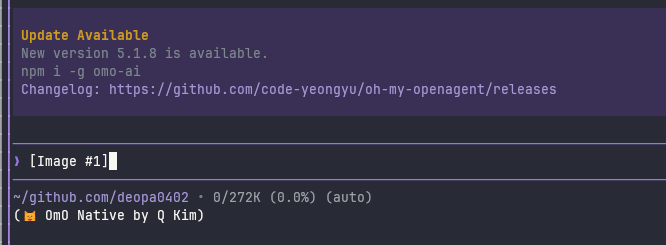

# Keybindings

All keyboard shortcuts can be customized via `~/.senpi/agent/keybindings.json`. Each action can be bound to one or more keys.

The config file uses the same namespaced keybinding ids that senpi uses internally and that extension authors use in `keyHint()` and injected `keybindings` managers.

Older configs using pre-namespaced ids such as `cursorUp` or `expandTools` are migrated automatically to the namespaced ids on startup.

After editing `keybindings.json`, run `/reload` in senpi to apply the changes without restarting the session.

## Key Format

`modifier+key` where modifiers are `ctrl`, `shift`, `alt`, `super` (combinable) and keys are:

- **Letters:** `a-z`
- **Digits:** `0-9`
- **Special:** `escape`, `esc`, `enter`, `return`, `tab`, `space`, `backspace`, `delete`, `insert`, `clear`, `home`, `end`, `pageUp`, `pageDown`, `up`, `down`, `left`, `right`
- **Function:** `f1`-`f12`
- **Symbols:** `` ` ``, `-`, `=`, `[`, `]`, `\`, `;`, `'`, `,`, `.`, `/`, `!`, `@`, `#`, `$`, `%`, `^`, `&`, `*`, `(`, `)`, `_`, `+`, `|`, `~`, `{`, `}`, `:`, `<`, `>`, `?`

Modifier combinations: `ctrl+shift+x`, `alt+ctrl+x`, `ctrl+shift+alt+x`, `super+k`, `ctrl+super+k`, `ctrl+1`, etc.

`super` bindings require a terminal that reports the modifier separately, typically through the Kitty keyboard protocol. They may not work in terminals without that support.

## All Actions

### TUI Editor Cursor Movement

| Keybinding id | Default | Description |
|--------|---------|-------------|
| `tui.editor.cursorUp` | `up` | Move cursor up, browsing older history at the top |
| `tui.editor.cursorDown` | `down` | Move cursor down, browsing newer history at the bottom |
| `tui.editor.historyPrevious` | *(none)* | Select the previous prompt history entry |
| `tui.editor.historyNext` | *(none)* | Select the next prompt history entry |
| `tui.editor.cursorLeft` | `left`, `ctrl+b` | Move cursor left |
| `tui.editor.cursorRight` | `right`, `ctrl+f` | Move cursor right |
| `tui.editor.cursorWordLeft` | `alt+left`, `ctrl+left`, `alt+b` | Move cursor word left |
| `tui.editor.cursorWordRight` | `alt+right`, `ctrl+right`, `alt+f` | Move cursor word right |
| `tui.editor.cursorLineStart` | `home`, `ctrl+home`, `ctrl+a` | Move to line start |
| `tui.editor.cursorLineEnd` | `end`, `ctrl+end`, `ctrl+e` | Move to line end |
| `tui.editor.jumpForward` | `ctrl+]` | Jump forward to character |
| `tui.editor.jumpBackward` | `ctrl+alt+]` | Jump backward to character |
| `tui.editor.pageUp` | `pageUp`, `ctrl+pageUp` | Scroll up by page |
| `tui.editor.pageDown` | `pageDown`, `ctrl+pageDown` | Scroll down by page |

The dedicated history actions always change history entries, regardless of the cursor position in a multiline prompt. Explicit history bindings take precedence over application actions while the main editor is focused, so binding `tui.editor.historyPrevious` to `ctrl+p` overrides model cycling in that context without changing `Ctrl+P` in selectors.

### TUI Editor Deletion

| Keybinding id | Default | Description |
|--------|---------|-------------|
| `tui.editor.deleteCharBackward` | `backspace` | Delete character backward |
| `tui.editor.deleteCharForward` | `delete`, `ctrl+d` | Delete character forward |
| `tui.editor.deleteWordBackward` | `ctrl+w`, `alt+backspace` | Delete word backward |
| `tui.editor.deleteWordForward` | `alt+d`, `alt+delete` | Delete word forward |
| `tui.editor.deleteToLineStart` | `ctrl+u` | Delete to line start |
| `tui.editor.deleteToLineEnd` | `ctrl+k` | Delete to line end |

### TUI Input

| Keybinding id | Default | Description |
|--------|---------|-------------|
| `tui.input.newLine` | `shift+enter`, `ctrl+j` | Insert new line |
| `tui.input.submit` | `enter` | Submit input |
| `tui.input.tab` | `tab` | Tab / autocomplete |

### TUI Kill Ring

| Keybinding id | Default | Description |
|--------|---------|-------------|
| `tui.editor.yank` | `ctrl+y` | Paste most recently deleted text |
| `tui.editor.yankPop` | `alt+y` | Cycle through deleted text after yank |
| `tui.editor.undo` | `ctrl+-` | Undo last edit |

### TUI Clipboard and Selection

| Keybinding id | Default | Description |
|--------|---------|-------------|
| `tui.input.copy` | `ctrl+c` | Copy selection |
| `tui.select.up` | `up` | Move selection up |
| `tui.select.down` | `down` | Move selection down |
| `tui.select.pageUp` | `pageUp` | Page up in list |
| `tui.select.pageDown` | `pageDown` | Page down in list |
| `tui.select.confirm` | `enter` | Confirm selection |
| `tui.select.cancel` | `escape`, `ctrl+c` | Cancel selection |

### TUI Fullscreen Viewport

These actions apply when interactive mode uses `--tui-mode fullscreen` and target the primary transcript scroll region. Two-finger trackpad and mouse-wheel input scroll the region under the pointer, falling back to the transcript over the fixed editor/status/footer dock. Clicking an OSC 8 hyperlink opens it in the default handler. Dragging with the primary mouse button selects text and copies it to the clipboard; holding at the transcript's top or bottom edge auto-scrolls into off-screen content. While the transcript is scrolled up, a clickable "Jump to latest message" label on its bottom row shows the `tui.altScreen.bottom` shortcut. See [Terminal setup](terminal-setup.md) for terminal-specific mouse and trackpad behavior.

Fullscreen transcript bindings take precedence over editor bindings. The default unmodified navigation keys therefore control the transcript in fullscreen mode, while their `ctrl` variants continue to control the editor. Outside fullscreen mode, both variants control the editor.

The transcript search panel shows the configured previous/next shortcuts and clickable arrow controls. Press `tui.altScreen.search` again, or use `tui.altScreen.searchClose`, to close it.

| Key | Default mode | Fullscreen mode |
|-----|--------------|-----------------|
| `home`, `end` | Editor | Transcript |
| `ctrl+home`, `ctrl+end` | Editor | Editor |
| `pageUp`, `pageDown` | Editor | Transcript |
| `ctrl+pageUp`, `ctrl+pageDown` | Editor | Editor |

This routing remains configurable through the ordinary action bindings. For example, `"tui.altScreen.pageUp": "ctrl+pageUp"` makes `pageUp` control the editor and `ctrl+pageUp` control the transcript in fullscreen mode. Bind `tui.altScreen.halfPageUp` and `tui.altScreen.halfPageDown` for half-page steps, or bind `tui.altScreen.lineUp` and `tui.altScreen.lineDown` for single-line steps. Setting `"tui.altScreen.pageUp": []` disables that transcript shortcut entirely. User bindings replace the defaults for that action.

| Keybinding id | Default | Description |
|--------|---------|-------------|
| `tui.altScreen.pageUp` | `pageUp` | Scroll the transcript up by one page |
| `tui.altScreen.pageDown` | `pageDown` | Scroll the transcript down by one page |
| `tui.altScreen.halfPageUp` | *(none)* | Scroll the transcript up by half a page |
| `tui.altScreen.halfPageDown` | *(none)* | Scroll the transcript down by half a page |
| `tui.altScreen.lineUp` | *(none)* | Scroll the transcript up by one line |
| `tui.altScreen.lineDown` | *(none)* | Scroll the transcript down by one line |
| `tui.altScreen.previousPrompt` | `ctrl+shift+up` | Jump to the previous marked message |
| `tui.altScreen.nextPrompt` | `ctrl+shift+down` | Jump to the next marked message |
| `tui.altScreen.search` | `ctrl+shift+f` | Search the rendered transcript |
| `tui.altScreen.searchNext` | `enter`, `ctrl+g` | Select the next search match while searching |
| `tui.altScreen.searchPrevious` | `shift+enter`, `ctrl+shift+g` | Select the previous search match while searching |
| `tui.altScreen.searchClose` | `escape` | Close transcript search |
| `tui.altScreen.top` | `home` | Scroll to the beginning of the transcript |
| `tui.altScreen.bottom` | `end` | Scroll to the transcript end and follow new output |

### Application

| Keybinding id | Default | Description |
|--------|---------|-------------|
| `app.interrupt` | `escape` | Cancel / abort |
| `app.clear` | `ctrl+c` | Clear editor (first) / exit (second) |
| `app.exit` | `ctrl+d` | Exit (when editor empty) |
| `app.suspend` | `ctrl+z` (none on Windows) | Suspend to background |
| `app.editor.external` | `ctrl+g` | Open in external editor (`externalEditor`, `$VISUAL`, `$EDITOR`, Notepad on Windows, or `nano` elsewhere) |
| `app.clipboard.pasteImage` | `ctrl+v` (`alt+v` on Windows and WSL) | Paste image or text from clipboard |
| `app.history.search` | `ctrl+r` | Search prompt history across sessions |

Direct local Warp-on-WSL sessions accept both `ctrl+v` and `alt+v` for clipboard paste. Other Windows/WSL terminals keep `alt+v`; SSH and multiplexer sessions do not enable the Warp-specific default. Explicit user bindings replace the shortcut defaults, but do not disable terminal-native bracketed-paste events.

When Warp sends an empty bracketed-paste event for a Windows clipboard image, the direct Warp-on-WSL composer reads the system clipboard through the same image/text paste handler. Non-empty bracketed text pastes and other terminal sessions keep their existing behavior.

This compatibility handling is limited to direct Warp-on-WSL sessions. It does not add Ctrl+V image paste support to Windows Terminal, native Windows, other WSL terminals, SSH, or multiplexers.

User-verified image attachment after Ctrl+V in Warp on WSL:



### Sessions

| Keybinding id | Default | Description |
|--------|---------|-------------|
| `app.session.new` | *(none)* | Start a new session (`/new`) |
| `app.session.tree` | *(none)* | Open session tree navigator (`/tree`) |
| `app.session.fork` | *(none)* | Fork current session (`/fork`) |
| `app.session.resume` | *(none)* | Open session resume picker (`/resume`) |
| `app.session.renameCurrent` | *(none)* | Rename the current session |
| `app.session.togglePath` | `ctrl+p` | Toggle path display |
| `app.session.toggleSort` | `ctrl+s` | Toggle sort mode |
| `app.session.toggleNamedFilter` | `ctrl+n` | Toggle named-only filter |
| `app.session.rename` | `ctrl+r` | Rename session |
| `app.session.delete` | `ctrl+d` | Delete session |
| `app.session.deleteNoninvasive` | `ctrl+backspace` | Delete session when query is empty |

### Models and Thinking

| Keybinding id | Default | Description |
|--------|---------|-------------|
| `app.model.select` | `ctrl+l` | Open model selector |
| `app.model.cycleForward` | `ctrl+p` | Cycle to next model |
| `app.model.cycleBackward` | `shift+ctrl+p` (`alt+p` on Windows and WSL) | Cycle to previous model |
| `app.models.save` | `ctrl+s` | In the model picker, select the highlighted model and make it the default for new sessions; in the scoped models selector, save the configuration |
| `app.thinking.cycle` | `shift+tab` | Cycle thinking level |
| `app.thinking.save` | `ctrl+s` | Save current thinking level to settings |
| `app.thinking.toggle` | `ctrl+t` | Collapse or expand thinking blocks |

### Display and Message Queue

| Keybinding id | Default | Description |
|--------|---------|-------------|
| `app.tools.expand` | `ctrl+o` | Collapse or expand tool output |
| `app.message.copy` | `ctrl+x` | Copy the selected message in `/tree`; otherwise copy the last assistant message, or the active fullscreen text selection when `fullscreenCopyOnSelect` is disabled |
| `app.message.followUp` | `alt+enter` | Queue follow-up message |
| `app.message.dequeue` | `alt+up` (`alt+q` on Windows and WSL) | Restore queued messages to editor when no pending question claims the chord |
| `app.question.answer` | `alt+up`, `alt+a` | Open the pending async question before dequeue. Enter on an empty editor also opens it; `/answer` lists multiple requests. On macOS, the Option-composed glyph of a bound letter is also accepted (except dead keys e, i, n, u). |
| `app.question.next` | `alt+down` | Cycle pending requests while the composer is empty and no overlay or autocomplete is open |

The question hint prefers `alt+up` (`option+up` on macOS). In tmux, Apple Terminal, Warp, and VS Code it shows the retained `alt+a` alternative. Both bindings remain active; there is no third fallback chord. On Windows and WSL, dequeue uses `alt+q`, so `alt+up` does not conflict with it. Tab completion and Shift+Tab thinking-level cycling are unchanged.

Pending-question option buttons also accept a single unmodified left click. A single-question choice answers immediately; the keyboard alternatives remain empty Enter, digits, the question chords, and `/answer skip`. While mouse capture is active, use your terminal's selection bypass (usually Shift-drag; Option-drag in iTerm2/Terminal.app). `terminal.mouse: "off"` disables capture without changing these bindings. See [Mouse Input](tui.md#mouse-input) for tmux and herdr limitations.

### Tree Navigation

| Keybinding id | Default | Description |
|--------|---------|-------------|
| `app.tree.foldOrUp` | `ctrl+left`, `alt+left` | Fold current branch segment, or jump to the previous segment start |
| `app.tree.unfoldOrDown` | `ctrl+right`, `alt+right` | Unfold current branch segment, or jump to the next segment start or branch end |
| `app.tree.editLabel` | `shift+l` | Edit the label on the selected tree node |
| `app.tree.editMessage` | `ctrl+e` | Edit the selected assistant response in the editor and continue from the edited copy; on a user message it behaves like `enter` |
| `app.tree.toggleLabelTimestamp` | `shift+t` | Toggle label timestamps in the tree |
| `app.tree.filter.default` | `ctrl+d` | Set tree filter to default view |
| `app.tree.filter.noTools` | `ctrl+t` | Toggle tree filter that hides tool results |
| `app.tree.filter.userOnly` | `ctrl+u` | Toggle tree filter that shows only user messages |
| `app.tree.filter.labeledOnly` | `ctrl+l` | Toggle tree filter that shows only labeled entries |
| `app.tree.filter.all` | `ctrl+a` | Toggle tree filter that shows all entries |
| `app.tree.filter.cycleForward` | `ctrl+o` | Cycle tree filter forward |
| `app.tree.filter.cycleBackward` | `shift+ctrl+o` | Cycle tree filter backward |

### Favorite Models Selector

Used inside the favorite models selector (opened via `/favorite-models`).

| Keybinding id | Default | Description |
|--------|---------|-------------|
| `app.models.save` | `ctrl+s` | Save current favorite model selection to settings |
| `app.models.toggleFavorite` | `ctrl+f` | Toggle favorite status of the selected model |
| `app.models.enableAll` | `ctrl+a` | Favorite all models (or all matching the current search) |
| `app.models.clearAll` | `ctrl+x` | Clear all models (or all matching the current search) |
| `app.models.toggleProvider` | `ctrl+p` | Toggle favorite models for the current provider |
| `app.models.reorderUp` | `alt+up` | Move the selected model up in the cycle order |
| `app.models.reorderDown` | `alt+down` | Move the selected model down in the cycle order |

## Custom Configuration

Create `~/.senpi/agent/keybindings.json`:

```json
{
  "tui.editor.historyPrevious": "ctrl+p",
  "tui.editor.historyNext": "ctrl+n",
  "tui.editor.deleteWordBackward": ["ctrl+w", "alt+backspace"]
}
```

Each action can have a single key or an array of keys. User config overrides defaults.

On native Windows, `app.suspend` has no default binding because Windows terminals do not support Unix job control. If you bind it manually, senpi shows a status message instead of suspending. In WSL, the normal Linux `ctrl+z`/`fg` behavior still applies.

### Emacs Example

```json
{
  "tui.editor.historyPrevious": "ctrl+p",
  "tui.editor.historyNext": "ctrl+n",
  "tui.editor.cursorLeft": ["left", "ctrl+b"],
  "tui.editor.cursorRight": ["right", "ctrl+f"],
  "tui.editor.cursorWordLeft": ["alt+left", "alt+b"],
  "tui.editor.cursorWordRight": ["alt+right", "alt+f"],
  "tui.editor.deleteCharForward": ["delete", "ctrl+d"],
  "tui.editor.deleteCharBackward": ["backspace", "ctrl+h"],
  "tui.input.newLine": ["shift+enter", "ctrl+j"]
}
```

### Vim Example

```json
{
  "tui.editor.cursorUp": ["up", "alt+k"],
  "tui.editor.cursorDown": ["down", "alt+j"],
  "tui.editor.cursorLeft": ["left", "alt+h"],
  "tui.editor.cursorRight": ["right", "alt+l"],
  "tui.editor.cursorWordLeft": ["alt+left", "alt+b"],
  "tui.editor.cursorWordRight": ["alt+right", "alt+w"]
}
```
